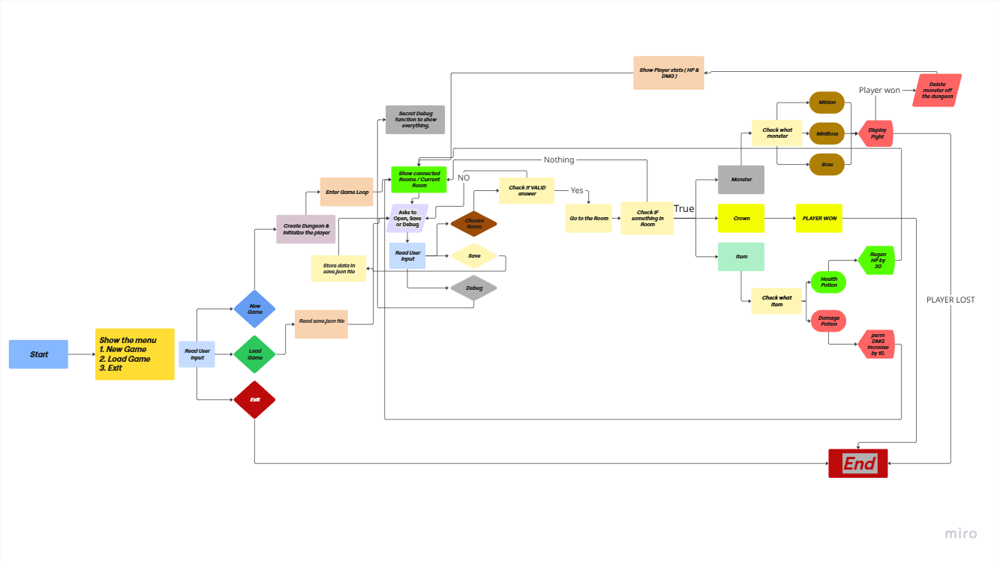

# Dungeon

## Dungeon Generation

**Implemented:**
- **Variable number of rooms**: The number of rooms in the dungeon is determined by the `roomCount` variable.
- **Graph structure with adjacency list**: Each room uses an adjacency list (`connectedRooms`) to store connections to other rooms.
- **1-4 connections per room**: Each room is connected to 1-4 other rooms.
- **Heap allocation**: The dungeon and its rooms are dynamically allocated using `malloc`.
- **Random item placement**: Health potions and damage boosts are randomly placed in rooms.

**Not Implemented:**
- **4-dimensional doubly linked list (optional)**: The adjacency list could be replaced with a doubly linked list structure with `north`, `south`, `east`, and `west` pointers.

---

## Player Mechanics

**Implemented:**
- **Player location tracking**: The player's current room is tracked using the `currentRoom` field.
- **Health points (HP) and damage**: The player has `hp` and `damage` attributes for survival and future combat.
- **Item usage**: Items are implemented to restore HP and boost player stats.
  - **Health Potion**: Restores 30 HP (capped at 100).
  - **Damage Boost**: Permanently increases the player's damage by 10.
- **Player movement**: The player can move between connected rooms.

---

## Room Content

**Implemented:**
- **Doors to other rooms**: Each room connects to 1-4 other rooms.
- **Unique room IDs**: Every room has a distinct `id`.
- **Item types**: Two types of items (health potions and damage boosts) are available and spawn randomly in rooms.
- **Monsters**: Rooms can contain monsters with varying types, `hp`, and `damage` values.
  - **Monster Types**:
    - **Minion**: Low HP and damage.
    - **Mini Boss**: Medium HP and damage.
    - **Boss**: High HP and damage.
- **Treasure (Crown)**: A crown is placed randomly; finding it ends the game.
---

## Combat System

**Implemented:**
- Random bitwise Combat: A random number between 0 - 16 is generated each round and converts it to binary.
- Turn-based attacks:
    ` 0 ` = Monster attacks.
    ` 1 ` = Player attacks.
- Multiple Rounds: New round starts if both fighter survives a round.

---

## Game Flowchart 

---

## Progress Summary

| Feature              | Status  |
| -------------------- | ------- |
| Dungeon Generation   | ✅ (Basic complete) |
| Player Mechanics      | ✅ (Item usage complete) |
| Room Content          | ✅ (Item types and multiple monsters complete) |
| Bitwise Combat        | ✅(Basic Combat) |
| Save_Load           | ✅(Basic Combat) |
---
